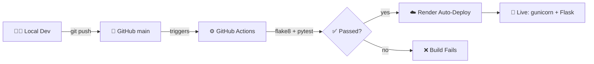

# 🎟️ Event Registration Portal

<div align="center">


</div>

**A lightweight, fully-tested, auto-deploying REST API for event registration and real-time seat tracking.**

[🔗 Live API](https://event-registration-portal-ygqa.onrender.com) · [📖 API Reference](#-api-reference) · [🚀 Quick Start](#-running-locally)

</div>

---

> ⚠️ **Cold start notice:** Hosted on Render's free tier. First request after ~15 min of inactivity takes 30–50s while the container wakes up. Every request after that is instant.

---

## 📌 Overview

This project implements a minimal but **production-shaped** backend for event registration — users can view live events and register against them, with the server enforcing seat limits atomically, rejecting bad input gracefully, and never crashing on edge cases.

The goal isn't feature volume — it's proving a **correct, tested, automatically-deployed service** end to end: local dev → automated CI on every commit → live public URL, with nothing hand-verified or "trust me it works."

---

## 🏗️ Architecture



Every push to `main` is independently linted and tested on a **clean Ubuntu VM** before it counts as verified. What's live on Render is always what passed CI — never an unverified commit.

---

## 🧰 Tech Stack

| Layer | Choice | Why |
|---|---|---|
| 🌐 Framework | **Flask 3.0** | Minimal, explicit routing for a small, well-defined API |
| ⚙️ WSGI Server | **Gunicorn** | Flask's dev server is single-threaded; gunicorn handles real concurrent traffic |
| 🧪 Testing | **Pytest** | In-process HTTP testing via `test_client()` — no real server spin-up needed |
| 🧹 Linting | **Flake8** | Enforces PEP8, catches unused imports before they ship |
| 🔁 CI | **GitHub Actions** | Lint + test on every push, on a clean disposable VM |
| ☁️ Hosting | **Render** | Auto-deploy from GitHub, zero server management |
| 🗃️ Data Store | **In-memory list** | Deliberate scope choice — see [Design Decisions](#-design-decisions) |

---

## 📡 API Reference

### `GET /health`
Health check — confirms the deployed instance is alive.

```json
200 OK
{ "status": "ok" }
```

### `GET /api/events`
Returns all events with live seat availability.

```json
200 OK
[
  { "id": 1, "name": "Hackathon", "seats_total": 50, "seats_left": 50 },
  { "id": 2, "name": "AI Workshop", "seats_total": 30, "seats_left": 0 }
]
```

### `POST /register/<event_id>`
Registers one participant, decrementing `seats_left` by 1.

| Outcome | Status | Response |
|---|---|---|
| ✅ Success | `200` | `{ "message": "registered", "seats_left": 49 }` |
| 🚫 Event full | `400` | `{ "error": "no seats left" }` |
| ❓ Event doesn't exist | `404` | `{ "error": "event not found" }` |

> **Why 400 vs 404?** A full event is a *valid ID, business-rule rejection* (400). A missing event is a *client addressing error* (404). Deliberately not collapsed into one code.

---

## 🚀 Running Locally

```bash
git clone <repo-url>
cd event-registration-portal

python -m venv venv
venv\Scripts\activate          # Windows
source venv/bin/activate       # macOS/Linux

pip install -r requirements.txt
python app.py
```

➡️ Runs at `http://127.0.0.1:5000`

---

## 🧪 Testing

```bash
pytest -v                       # run test suite
flake8 app.py test_app.py       # run linter
```

| ✅ Test | Verifies |
|---|---|
| `test_health` | `/health` returns 200 + correct payload |
| `test_register_success` | Valid registration decrements seats correctly |
| `test_register_blocked_at_zero` | Full event returns 400, doesn't crash |
| `test_register_not_found` | Bad event ID returns 404 |

All 4 tests use Flask's in-process `test_client()` — fast, isolated, no real network calls.

---

## 🔁 CI/CD Pipeline

Defined in [`.github/workflows/ci.yml`](.github/workflows/ci.yml)

**Triggers:** every push/PR to `main`
**Steps:** checkout → set up Python 3.13 → install deps → `flake8` → `pytest -v`

Runs on a **clean, disposable Ubuntu VM** with nothing pre-installed — a passing run proves `requirements.txt` is complete, not just "works on my machine." Render auto-deploys separately from the same repo on every push to `main`.

---

## 🎯 Design Decisions

**Why in-memory data, not a database?**
Deliberate scope decision, not an oversight. The assignment calls for a working, tested, deployed seat-counter — not persistence. A database here would add operational overhead (connections, migrations, credentials) with no requirement driving it. The tradeoff (state resets on restart) is acknowledged, not accidental.

**Why `abort(404, ...)` over manual response tuples?**
Keeps error handling idiomatic to Flask instead of hand-rolling every failure path.

**Why `next(generator, None)` over a list comprehension for lookup?**
A list comp builds the entire filtered list before taking one item; `next()` short-circuits at the first match. Negligible at 2 events — correct habit at scale.

---

## ⚠️ Known Limitations

- 🔄 **No persistence** — data resets on restart/redeploy
- 🔓 **No authentication** — endpoints are open to anyone with the URL
- 🧵 **Shared test state** — `test_register_success` mutates global seat count; re-running the suite without a restart shows cumulative decrements (acceptable at this scope)
- 🐌 **Free-tier cold starts** — see notice at top

---

## 📁 Project Structure

```
.
├── .github/
│   └── workflows/
│       └── ci.yml          # CI pipeline
├── app.py                  # Routes, event data, logic
├── test_app.py             # Test suite
├── requirements.txt
├── .gitignore
└── README.md
```

<div align="center">

**Built by Soham Patil**

</div>
